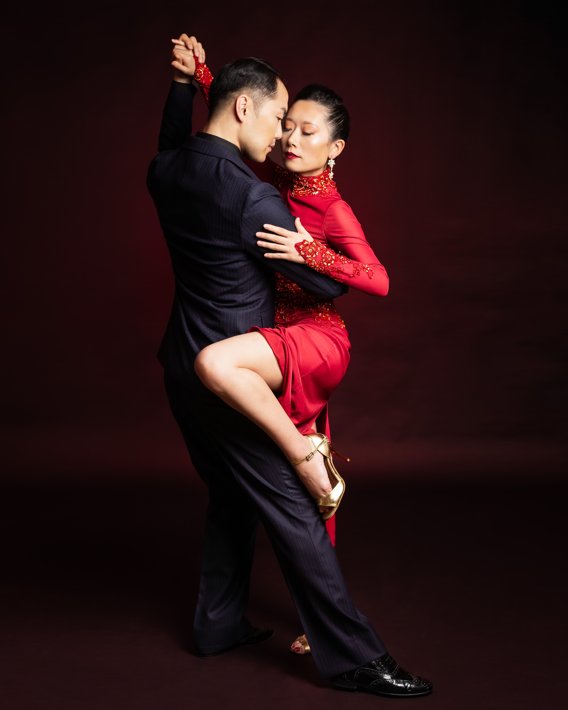

## Toru & Etsuko タンゴ活動履歴（2024/8/25 更新）

### プロフィール

2017年にペア結成。平日はダンス以外の仕事をしながら、タンゴを普及すべく、主に京都にて活動中。イベントへの出演ほか、毎週末の練習会開催（Kyoto Tango Club）、海外アーティストの招聘、企画・運営のサポートを行なっている。また、KANSAI Tango Orquesta専属ダンサーとしても活動中。

*Photo © Miguel Santillan*

---

### 出演歴（全文）

* 京都 祇園Repos 女優 杉本彩の誕生日パーティーにて杉本彩本人と共演 2017年、2018年
* 大阪 阪急うめだ店「ラテンバザール展 タンゴ」2018年9月
* 大阪 関西領事団会合「Latin American Evening」2019年6月7日
* 大阪 すてっぷホール カンサイ・タンゴ・オルケスタ 第1回記念コンサート 2019年10月22日
* 滋賀 東洋紡総合研究所60周年イベント 2020年11月16日
* 京都 烏丸御池 灯 「アルゼンチンタンゴショー」 2020年11月23日
* 大阪 豊中市文化芸術センター 小ホール カンサイ・タンゴ・オルケスタ　第2回定期コンサート 2020年12月20日
* 京都 文化パルク城陽プラネタリウム「アルゼンチンタンゴ〜100年の情熱〜」 2021年2月20日
* 京都 烏丸御池 灯 「Akari Milonga in Kyoto」 2021年3月20日
* 京都 文化パルク城陽プラネタリウム「真夏の夜のタンゴ」2021年8月29日
* 大阪 西天満 カフェティン・デ・ブエノスアイレス「アルゼンチンタンゴショー」2021年10月30、31日
* 東京 銀座 リベルタンゴ「Platinum Milonga Special」 2021年11月3日
* 大阪 京橋ベロニカ 「Love Passion Tangoshow 〜愛と情熱のタンゴショー〜」2021年12月27日
* 大阪 京橋ベロニカ 「Tango Fantasia 2021 〜タンゴ・ファンタシア2021〜」2021年12月30日
* 京都 文化パルク城陽プラネタリウム「タンゴ〜ブエノスアイレスの街角より〜」2022年3月6日
* 福岡 ティエンポ・イベロアメリカーノ「サクラタンゴフェスティバル 2022 After Milonga」2022年4月10日
* 大阪 西天満 カフェティン・デ・ブエノスアイレス「Ensueno Milonga」2022年5月29日
* 大阪 SPinniNG MiLL 「KANSAI Tango Orquesta Spring Live」2022年6月5日
* 大阪 グランサロン十三「OSAKA TANGO WEEKEND」2022年7月17日
* 大阪 心斎橋Music Club JANUS 「ELLA BAILA —Tango Live Show 2022, ナタリア・ヒルズ アジアツアー2022」2022年8月14日
* 滋賀 旧大津公会堂 第34回サルサ・カンデーラ　ージャパン・アフロ・ラテン・フェス2022ー　2022年8月15日
* 京都 文化パルク城陽プラネタリウム「星空のアルゼンチンタンゴ」2022年8月20日
* 大阪 西天満 カフェティン・デ・ブエノスアイレス「アルゼンチンタンゴライブ」2022年8月21日
* 兵庫 宝塚EL Puente「El Puente Milonga」 2022年8月27日
* 大阪 西天満 カフェティン・デ・ブエノスアイレス「Millonga Berretin」2022年9月3日
* 大阪 SPinniNG MiLL「KANSAI Tango Orquesta Autumn Concert」2022年11月23日
* 京都 祇園Para Dos 「クリスマスミロンガ — Special Guests : Fabian Peralta y Josefina Bermudez— 」2022年12月4日
* 京都 北山モノリス 「花パーティー」 2023年1月8日
* 京都 河原町 カフェ・ルンビータ「Tango Grelio第3版CD発売記念 京都公演」 2023年1月15日
* 京都 京都コンサートホール アンサンブルホールムラタ A Hana of music 音楽の仲間「花」第37回コンサート　〜ひとひら、ひとひらの花びらでひとつの「花」を〜 2023年2月19日
* 韓国 ソウル Mapo Art Center劇場「EL CXUCLE Theater Show, 監修Facundo Piñero & Vanesa Villalba」2022年2月26日
* 京都 文化パルク城陽プラネタリウム「Tango Cinematico 〜ロマンティックタンゴと映画音楽の世界〜」2023年3月4日
* 東京 駒込タンゴ・リトゥモ 「Ritmo Milonga」2022年4月1日
* 福岡 ティエンポ・イベロアメリカーノ「サクラタンゴフェスティバル 2023 After Milonga」2022年4月8日
* 兵庫 宝塚EL Puente「El Puente Milonga」 2023年4月22日
* 京都 ヒューリックホール京都「第67回サルサ・カンデーラ 京都国際ラテンダンス・ミュージックフェスティバル」2023年5月4日
* 京都 京あんしんこども館 「第9回すこやかサロン」2023年6月16日
* 京都 京都コンサートホール アンサンブルホールムラタ A Hana of music 音楽の仲間「花」第38回コンサート　〜ひとひら、ひとひらの花びらでひとつの「花」を〜 2023年8月13日
* 京都 けやきの夏祭り「アルゼンチンタンゴの演奏・ダンス♪」2023年8月19日
* 大阪 SPinniNG MiLL「KANSAI Tango Orquesta Summer Concert」2023年8月20日
* 大阪 西天満 カフェティン・デ・ブエノスアイレス「Berretin Milonga」2023年9月17日
* 京都 ヒューリックホール京都 「Kyoto Anniversary Milonga - ルンビータ20周年・ロドリゴ生誕70周年記念 - 」2023年10月7日
* 岡山 ホワイトキャンバス「ビバ★タンゴ!! 〜アルゼンチンタンゴ　見て、聴いて、踊って楽しむ音楽とダンス〜」 2023年10月21日
* 広島 BAR & Space9 「広島タンゴ感謝祭 可惜夜ミロンガ（最終夜）」 2023年10月29日
* 京都 烏丸御池 水田ダンススタジオ「ハートフルに踊ろう El dia dio Tango KYOTO」2023年12月10日
* 大阪 堺 フェニーチェ堺小ホール「KANSAI Tango Orquesta Concert -EL TANGO-」2024年1月27日
* 大阪 大阪市立旭区民センター・小ホール 旭でレクチャーコンサート「アルゼンチンタンゴの世界」 vol.4 〜タンゴ＋ダンス＆タンゴ＋ジャズ〜2024年2月18日
* 東京 赤坂 Parados 「For export」 2024年2月29日
* 東京 東京芸術劇場前野外広場 アルゼンチンタンゴ Flash Mob 2024年3月3日
* 福岡 ティエンポ・イベロアメリカーノ「サクラタンゴフェスティバル 2024 After Milonga」2024年3月23日
* 大阪 中央公会堂 大集会室「Memorias De CARLOS GARDEL -追憶 Osaka Tango meets Leonardo Pastore-大阪公演」2024年3月31日
* 京都 Parados Tango Dream 2024年4月7日
* 大阪 阪急電車なにわ駅 アートエリアB1 「Kansai Tango Orquesta, 駅ナカでタンゴ」2024年5月18日
* 京都 けやきの夏祭り「アルゼンチンタンゴの演奏・ダンス♪」2024年8月17日
* 京都 京都コンサートホール アンサンブルホールムラタ A Hana of music 音楽の仲間「花」第40回コンサート　〜ひとひら、ひとひらの花びらでひとつの「花」を〜 2024年8月18日
* 大阪 SPinniNG MiLL「KANSAI Tango Orquesta Summer Concert」2024年8月25日

---

### ラジオ・TV出演

* **FM79.7 ラジオカフェ京都三条**：Ricaのタンゴ・カフェへようこそ！ OA ゲスト：武長 徹「踊り子（Danzarin）」2019年12月19日
* **朝日放送テレビ**：「芸能人格付けチェック！ 2022お正月スペシャル」チェック4「アルゼンチンタンゴ」2022年1月1日

---

### 掲載記事

* **ダンス雑誌「ダンスビュー」**（2019年10月号）：京タンゴ同好会（現：Kyoto Tango Club）について

---

### 受賞歴

* **2019年4月14日**：アルゼンチンタンゴダンスアジア選手権西日本大会 ピスタ部門 人気投票 第1位
* **2021年9月12日**：OPEN DUTCH TANGUERIL（オンライン開催）優勝

---

### 主催・協力イベント

* **練習会**：京タンゴ同好会（Kyoto Tango Club）毎週土曜日10−13時（2018年12月〜）
* **イベント・体験会**：2019年9月−2020年1月（京都市中京区青少年活動センター）
* **招聘・主催イベント例**：

  * カフェ・ルンビータ Pablo & Lucia 日本ツアー 2019
  * Ernesto y Paola in Kyoto（2019〜2022年）
  * NPO法人タンゴセラピー協会主催イベント
  * 京都文化博物館別館ホール「京都タンゴ美術館2023」
  * 東京芸術劇場前 Flash Mob（2024年） など

---

### 今後の予定

随時更新

---

📩 **出演依頼・お問い合わせは[こちらのページへ](https://torutakenaga.com/contact)**
